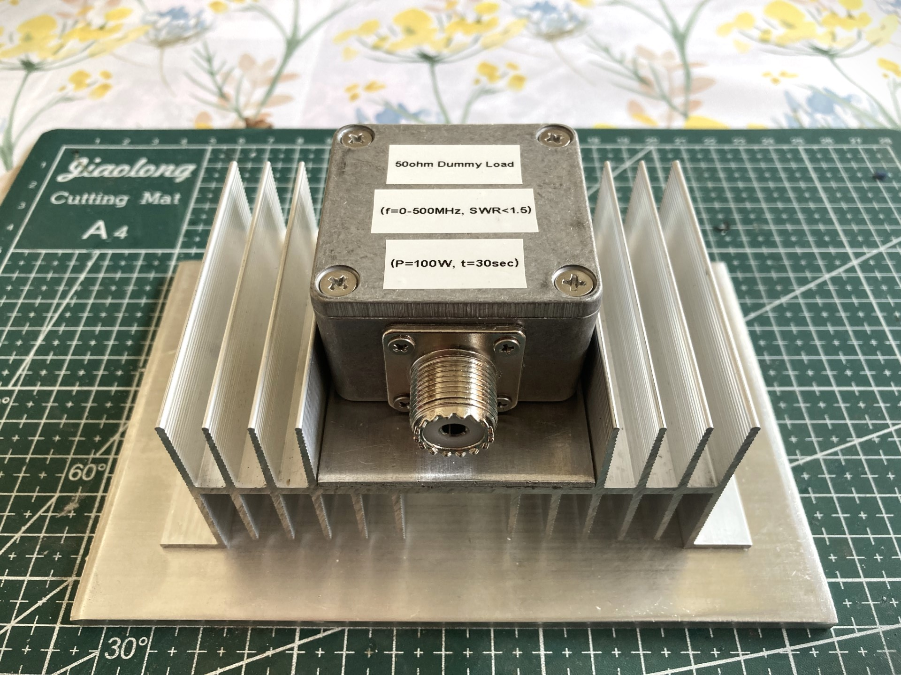

## RF 50ohm Dummy Load

 

## Credits

* Zygi SP5ELA for describing measurement methodology of HF transceiver output power.

## Design Overview

Presented RF Dummy Load shows aceptable SWR level (below 1.5) in the frequency range up to 500MHz. It is capable of withstanding up to 100W of power applied over up to 30sec time interval in ambient temperature of 26C. Theoretically calculated limit was in fact about 200W in ambient temperature of 26C, but this case was never verified in practice.
Design is based on inductance-less RFP-250 resistor manufactured by Anaren (or similar such as RFR 50-250).
This is rather mechanical then electronics project. The main challange was to ensure proper heat dissipation and keeping connections between resistor and UC1 socket as short as possible(in order to limit parasitic inductance).

## Performance

Achieved dummy load performance is best described by the following graphs:

### VSWR Measurements for the frequency range of 10kHz-500MHz:

### Derating Curve
This curve shows theoretically calculated time limits within, which dummy load can be safely subjected to given power levels. See Performace Evaluation section of this document for details.

### Smith Chart
Negligable amount of inductance visible in the measurements. For frequencies above 2m band (above 146MHz), effects of leakage capacitance starts to show. Acording to the manufacturer, leakage capacitance value is about 3pF.

## Characteristics Evaluation

### Measurement Setup

Simple digital thermometer was used to measure actual surface temperatures of the resistor: $tamb$ - resistor temperature when no power is applied to it and $tpwr$ - resistor temperature when given power is applied. The test setup used can be seen below:

### Test 1: Measurement of temperature increase in Celcius per Watt of applied power

The first measurement aimed to establish the temperature increase in Celcius per Watt of applied power $dt[C]/P[W]$. For each measurement point (power value), transmitter has been activated for the same duration of time $tdah$=15sec. Results has been summarized below:

From obtained results it is clear that relation between temperature increase in Celcius per Watt of applied power is linear within applied power range of 5 to 100W and can be described by the following formula:

(1) $dt[C] = 0.3384*P[W] - 0.7646$ where $dt = tpwr - tamb$

Average measured $dt/P = 0.32 [C/W]$

From resistor datasheet it is possible to find maximum element temperature for which resistor behaves according to original specification.

such temperature $tmax$ is equal to 100C.

Based on such information we can calculate maximum power dummy load can sustain for 15sec in given ambient temperature $tamb$ (in our case 26.6C):

(2) $dt = tmax - tamb = 100 - 26.6 = 73.5C$

using (1) we get: 

$Pmax = (dt+0.7646) / 0.3384 = 219W$

So based on derived model, theoretical maximum power our dummy load can sustain for 15 seconds is 219W.

### Test 2: Measurement of temperature increase in Celcius per duration given power is applied

The second measurement aimed to establish the temperature increase in Celcius per time in seconds during, which given power was applied to dummy load $dt[C]/tdah[sec]$. For each measurement point (measurement duration $tdah$), transmitter power was set to 100W. Results has been summarized below:

From obtained results it is clear that relation between temperature increase in Celcius per time in seconds during, which 100W of power was applied to dummy load is linear within applied $tdah$ time intervals of  5 to 20 seconds and can be described by the following formula:

(3) $dt[C] = 2.216 * tdah[sec] + 2.55$ where $dt = tpwr - tamb$

Average measured $dt/tdah = 2.37 [C/sec]$

From (2) we know that maximum allowed resistor temperature increse is 73.5C for ambient temperature of 26.6C.

Maximum allowed time 100W power can be applied to our dummy load can be calculated as $73.5 / 2.37 = 31sec$ similar result can be also obtained using formula (3).

### Calculation of Dummy Load Derating Curve

From Test 2, we know that relation between temperature increse and time during which given power is applied is linear. This fact combined with calculated temperature increase per Watt of applied power for different power levels $dt/P$ in Test 1, allows us to calculate derating curve as seen below:

## References

[1] "???"